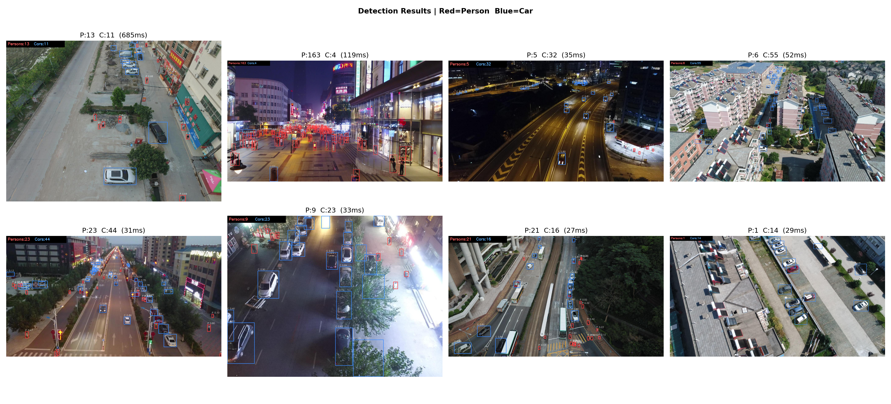

# ANTS_CV — Drone-Based Human and Car Detection

Fine-tuned YOLOv8s on the VisDrone dataset for person and car detection, live counting, and multi-object tracking in aerial drone footage.

---

## Project Overview

Drone imagery presents a specific set of challenges for object detection: objects appear very small relative to the frame, scenes are dense, and standard detection models trained on ground-level images perform poorly out of the box. This project addresses those challenges through targeted preprocessing, augmentation strategy, and inference configuration.

The system detects persons and cars, overlays bounding boxes with confidence scores, displays per-frame counts, and tracks objects across video frames with persistent IDs using ByteTrack.

---

## Repository Structure

```
ANTS_CV/
│
├── 01_eda.py               # Exploratory analysis — class distribution, bbox sizes, object density
├── 02_build_dataset.py     # Class remapping (10 → 2) and YOLO train/val/test split
├── 03_train.py             # YOLOv8s fine-tuning with augmentation and hyperparameter config
├── 04_detect.py            # Test-set inference with bounding box overlay and object counting
├── 05_track.py             # Test video construction and ByteTrack multi-object tracking
├── 06_evaluate.py          # Full test-split evaluation: precision, recall, mAP, per-class
│
├── visdrone.yaml           # YOLO dataset configuration (paths and class names)
├── yolov8s.pt              # YOLOv8s base weights (ImageNet pre-trained)
│
├── eda.png                 # EDA output — 3-panel figure
├── detection_results.png   # Sample detection grid across 8 test images
├── test_sequence.avi       # Input video assembled from test images
└── TRACKING_BONUS_AVI.avi  # ByteTrack output video with persistent object IDs
```

---

## Dataset

**Source:** [VisDrone Dataset](https://github.com/VisDrone/VisDrone-Dataset)

VisDrone contains drone-captured images annotated across 10 object classes. For this project, the label space was reduced to two task-relevant classes:

| Remapped Class | Original Classes Included |
|---|---|
| `person` (0) | pedestrian, people |
| `car` (1) | car, van |

All other classes (bicycle, truck, tricycle, awning-tricycle, bus, motor) were discarded during preprocessing.

**Split:** 80% train / 15% validation / 5% test

**Key challenges identified in EDA:**
- Severe class imbalance — cars appear 4 to 5 times more frequently than persons
- Bounding boxes are very small — most fall under 5% of image width
- Object density varies widely — from under 10 to over 300 objects per image

---

## Model and Training

**Architecture:** YOLOv8s (small variant), fine-tuned from ImageNet weights

The small variant was selected over nano for its additional model capacity, which is necessary for detecting objects at the scale typical of drone imagery.

| Hyperparameter | Value | Rationale |
|---|---|---|
| Image size (train) | 800 | Larger input increases effective object size for the model |
| Image size (inference) | 960 | Further increased at test time to maximize small-object recall |
| Optimizer | AdamW | Better gradient handling for sparse, small-object scenes |
| Epochs | 35 | With early stopping at patience 12 |
| Mosaic augmentation | 1.0 | Simulates dense multi-object drone scenes |
| Mixup | 0.15 | Improves generalization across varied backgrounds |
| Copy-paste | 0.15 | Increases small-object instance density synthetically |
| Confidence threshold | 0.10 | Low threshold to reduce missed detections |

---

## Pipeline

**01_eda.py** — Samples 500 images from the raw dataset, aggregates class frequencies, measures normalized bounding box dimensions, and plots a 3-panel summary figure: class distribution, objects-per-image histogram, and bounding box size scatter.

**02_build_dataset.py** — Reads all image and annotation files, applies the class remap, drops out-of-scope objects, and writes the filtered dataset into the YOLO directory structure under `data/yolo/`.

**03_train.py** — Calls `YOLO("yolov8s.pt").train()` with the full hyperparameter configuration. Saves weights to `runs/detect/visdrone_upgrade/weights/best.pt`.

**04_detect.py** — Loads the best checkpoint and runs inference on 8 randomly sampled test images at `imgsz=960` with test-time augmentation. Draws red bounding boxes for persons, blue for cars, and overlays per-frame counts in the top-left corner. Saves the result grid to `outputs/detection_results.png`.

**05_track.py** — Assembles 80 test images into a video file, then runs `model.track()` with ByteTrack. Each object receives a unique ID that persists across frames. Saves the annotated tracking video to `outputs/tracking/bytetrack_out/`.

**06_evaluate.py** — Runs `model.val()` on the test split with `imgsz=960`, `conf=0.10`, `augment=True`, and reports precision, recall, mAP@0.5, mAP@0.5:0.95, and per-class mAP.

---

## Results

### Detection Output



Red boxes indicate persons. Blue boxes indicate cars. Per-frame counts are displayed in the top-left overlay of each image.

### Evaluation Metrics (Test Split)

| Metric | Score |
|---|---|
| Precision | 0.771 |
| Recall | 0.518 |
| mAP @ 0.5 | 0.551 |
| mAP @ 0.5:0.95 | 0.307 |
| Person mAP | 0.127 |
| Car mAP | 0.487 |

The gap between person mAP (0.127) and car mAP (0.487) is consistent with the class imbalance observed during EDA. The model encountered significantly fewer person instances during training, which directly limits recall for that class.

### Tracking Output — ByteTrack, 80 Frames

| Observation | Value |
|---|---|
| Max persons detected in one frame | 161 (frame 6) |
| Max cars detected in one frame | 109 (frame 69) |
| Average inference time | ~25 ms per frame |
| Effective throughput | ~35–40 FPS |

---

## Strengths and Limitations

**Strengths**

- Precision of 77.1% indicates reliable predictions with a low false positive rate
- Real-time throughput (~35 FPS) makes the system viable for live drone feeds
- Functions under varied lighting conditions including nighttime scenes
- ByteTrack adds cross-frame object identity at no additional training cost

**Limitations**

- Person recall is limited by class imbalance in the training distribution
- Very small or heavily occluded objects are still missed even at low confidence thresholds
- Per-frame counting has no temporal smoothing, so counts fluctuate between frames

**Potential improvements**

- SAHI (Sliced Inference) to improve small-object recall through tiled detection
- Class-balanced sampling during training to narrow the person/car performance gap
- Temporal count smoothing using a rolling average across frames

---

## Installation

```bash
pip install ultralytics opencv-python matplotlib tqdm
```

Requires Python 3.8 or later. A CUDA-capable GPU is recommended for training and real-time inference.

---

## Task Completion

| Task | Status |
|---|---|
| Dataset understanding and EDA | Complete |
| Preprocessing and class remapping | Complete |
| YOLOv8s fine-tuning | Complete |
| Detection with bounding boxes and counting | Complete |
| Evaluation with precision, recall, mAP | Complete |
| ByteTrack multi-object tracking (bonus) | Complete |
